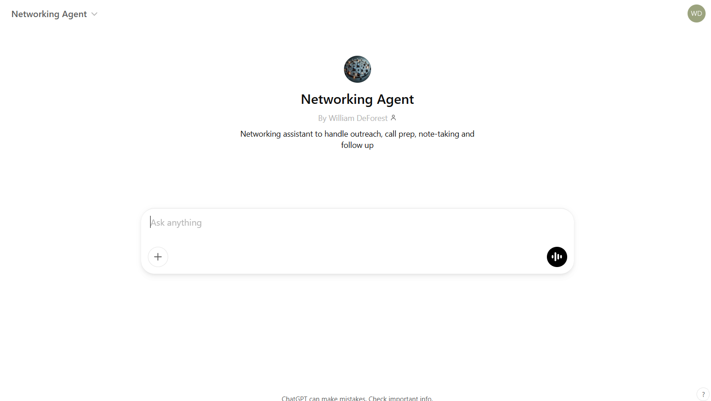
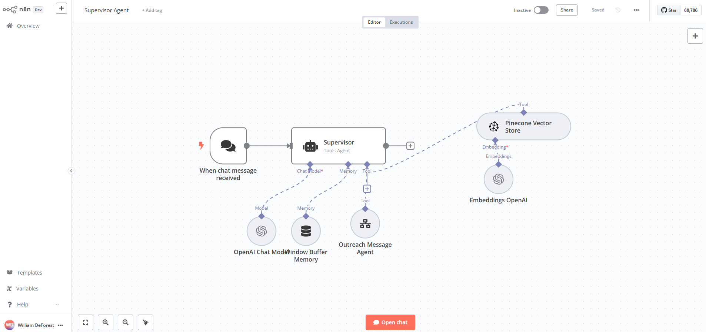

# AI-Powered Networking Agent

## Introduction

As a recent graduate looking to enter a highly competitive job market, I've found that standing out among hundreds of applicants requires more than just good grades and relevant internships. Informational interviews and genuine networking have become critical to my job search strategy, providing insights, potential referrals, and opportunities to learn from professionals. In addition, I found that once I got over the initial hump of self-consciousness, networking is an amazing way to meet and learn from incredible people - and it's genuinely super fun.

## Problem

However, effective networking—while essential—is highly time-consuming and repetitive. For me, it involves:
- **Personalized Communication:** Crafting genuine, tailored messages.
- **Research & Preparation:** Carefully researching the person and company and preparing my goals and questions for the meeting.
- **Organization:** Keeping track of outreach, follow-ups, and conversation notes.

Managing these steps manually can lead to inefficiencies, inconsistencies, and missed opportunities.

## Project Objective

I've created this project to streamline my personal networking workflow using AI, making it easier for me to engage meaningfully and consistently without sacrificing quality or authenticity.

I'm also using this project as an opportunity to try out different AI tools from pre-built solutions like OpenAI's GPTs to using Cursor to build completely from scratch. Therefore, as you will notice in this repository and readme, I have created three separate solutions - each with its own folder and section in the readme below.

## My Current Workflow

First, since everyone's networking process is a little different, here is a quick description of my existing networking process:

1. **Identifying Connections:** Searching for alumni or relevant professionals at target companies using alumni portals, LinkedIn, and family/friends.
2. **Initial Outreach:** Sending personalized LinkedIn messages, texts, or emails. This typically requires researching the person's career path and current company/role.
3. **Conversation Preparation:** Creating detailed guides for each conversation, including personalized introductions, tailored questions, and comprehensive background research.
4. **Conducting Conversations:** Engaging in thoughtful discussions and capturing detailed notes - typed or by hand.
5. **Follow-ups:** Organizing conversation summaries and sending timely thank-you messages.

While effective, this process is labor-intensive and repetitive.

### My Desired Workflow

After some experimenting and process mapping, I developed the following vision for my networking workflow.

1. **Profile Upload (Manual):** I manually upload a PDF of the target person's LinkedIn profile.
2. **AI Analysis (Automated):** The agent analyzes the profile for key insights.
3. **Personalized Message Generation (Automated):** The AI generates a draft outreach message consistent with my personal writing style.
4. **Review and Send (Manual):** I review the personalized message (make edits if needed) and send via LinkedIn, text, email, etc
5. **Scheduling Conversations (Hybrid):** If needed and when prompted, the agent helps draft follow up messages to schedule the meeting. I manually choose the date/time and add it to my calendar (I'm very particular about my calendar and I haven't found any AI calendar integrations that are good enough yet).
6. **Conversation Preparation (Automated):** The agent generates a detailed, personalized "Conversation Prep Guide that contains goals, an "about me" section, thoughtful questions, and different ways to wrap up the meeting based on the direction of the conversation."
7. **Note Taking (Automated):** If the call is online or over the phone and with the connection's consent, the AI agent will transcribe the conversation and automatically generate notes, takeaways and action items.
8. **Post-Conversation Summary and Thank You Notes (Automated):** The AI creates a summary of the conversation and drafts a short, personalized thank you note or follow up message.
9. **Follow-Up Reminder (Automated):** If a thank-you message hasn't been sent within 12 hours post-conversation, the agent reminds me via email.
10. **Documentation (Automated):** Throughout the process, the agent automatically updates a tracking table in Google Sheets.

## The Three Approaches I am Taking:

1. **OpenAI Custom GPT:** [Networking Agent Custom GPT](https://chatgpt.com/g/g-67cc8aab4f28819191b8e061b0f5e91f-networking-agent)

- Prompt: [GPT Prompt](01_custom_gpt/chatgpt_project_instructions.docx)
- Knowledge Base: [GPT Knowledge Base](context)
- Pros:
- Cons:

2. **n8n Agentic Workflow:**

- Prompt:
- Knowledge Base:
- Pros:
- Cons:

3. **Local web app developed using Cursor:**

- Prompt:
- Knowledge Base:
- Pros:
- Cons:

## Future Improvements

- **Direct LinkedIn API Integration:** Automate message sending. Potentially use LinkedIn MCP in n8n and Cursor?
- **Enhanced AI Personalization:** Continuously fine-tuning the AI model to better reflect my communication style. Experiment with different models, prompting, knowledge base, etc.
- **Integrated Calendar Management:** Automating calendar management. 

## Conclusion

This Networking Agent project showcases my proactive, entrepreneurial mindset and my commitment to leveraging AI to enhance my personal efficiency and effectiveness. By automating repetitive tasks, I can spend more time engaging authentically, fostering valuable professional relationships, and achieving my career goals.

